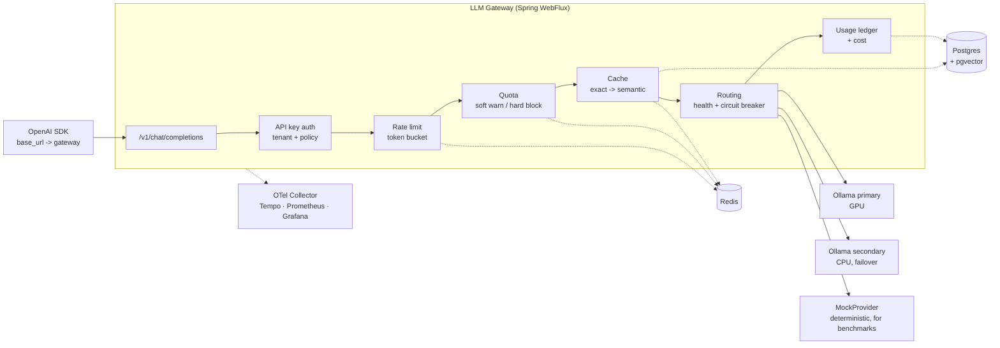

# LLM Gateway

An AI control plane: a multi-tenant reverse proxy that puts **one OpenAI-compatible endpoint** in
front of several LLM providers, adding authentication, quotas, rate limiting, caching, failover,
cost accounting and distributed tracing.

Any OpenAI SDK works against it by changing `base_url` and nothing else.

> **Status: M1 of 10 — it proxies.** Non-streaming `/v1/chat/completions` works end to end against
> a local Ollama and against a deterministic mock provider; the official `openai` Python SDK talks
> to it with only `base_url` changed. Streaming, authentication, rate limiting, quotas, caching and
> failover are not implemented yet — see [Roadmap](#roadmap). This notice is updated as milestones
> land, and no capability is claimed here before it exists and is tested.
>
> **The endpoint is currently unauthenticated.** API keys and tenants arrive in M3.

## Why this exists

Once an organisation has more than one team calling more than one model, the questions stop being
about prompts and start being about control: who is allowed to call what, who pays for it, what
happens when a provider degrades, and how you answer "why did that request cost €4". Those are
platform problems, and they belong in front of the model rather than inside every application.

The entire system runs on a laptop with `docker compose up` and **no API keys and no paid
services** — a deliberate constraint, not a limitation of the design. Providers sit behind a single
`LlmProvider` port, so adding a commercial provider is a configuration change.

## Architecture



The request pipeline runs cheapest-and-most-likely-to-reject first: auth → model allow-list →
rate limit → quota → cache → routing → provider → ledger.

## Quick start

Requires Linux with Docker; `bootstrap-dev.sh` installs everything else.

```bash
git clone https://github.com/mehmetztrk/llm-gateway.git
cd llm-gateway
./scripts/bootstrap-dev.sh      # Java 21, Docker, NVIDIA toolkit, k6 (asks for sudo)
docker compose up -d            # Postgres + Redis + two Ollama instances
./scripts/pull-models.sh        # ~2 GB, one time
./gradlew check                 # build and test
```

Then run the gateway:

```bash
./gradlew bootRun --args='--spring.profiles.active=local'
```

```bash
curl -s http://localhost:8080/actuator/health
```

Send it a completion — `mock-fast` needs no model and no GPU:

```bash
curl -s http://localhost:8080/v1/chat/completions -H 'Content-Type: application/json' -d '{"model":"mock-fast","messages":[{"role":"user","content":"hello"}]}'
```

Or prove SDK compatibility for yourself:

```bash
pip install openai && python scripts/verify-openai-sdk.py --model qwen2.5:1.5b-instruct
```

No NVIDIA GPU? Set `COMPOSE_FILE=docker/compose.yaml` in `.env` — everything still runs, on CPU.

## Stack

Java 21 · Spring Boot 3.5 (WebFlux) · Spring Security · Resilience4j · Redis · PostgreSQL +
pgvector + Flyway · OpenTelemetry (GenAI semantic conventions) → Tempo / Prometheus / Grafana ·
Testcontainers · JUnit 5 · AssertJ · WireMock · k6 · GitHub Actions. Everything free and
self-hosted.

## Privacy: prompts are not logged

`gateway.observability.log-prompts` defaults to `false` and a test pins that default.

A gateway is the one component that sees every prompt from every tenant, which makes it the worst
possible place to leak them. Prompts routinely contain customer names, support-ticket contents,
source code and credentials pasted by users; logs are replicated, retained and searched far more
widely than a request body ever is. Turning this flag on centralises all of that into a log
aggregator under a single retention policy nobody reviewed. It exists for local debugging and
should never be enabled against real traffic.

## Roadmap

| | Milestone | Status |
|---|---|---|
| M0 | Repo skeleton, compose stack, health endpoint, CI | ✅ done |
| M1 | Provider port, Ollama + Mock, non-streaming passthrough | ✅ done |
| M2 | SSE streaming, backpressure, mid-stream failure | ⬜ |
| M3 | Tenants, API keys, Flyway schema | ⬜ |
| M4 | Rate limiting, quotas, 429 semantics | ⬜ |
| M5 | Routing, circuit breaker, failover + chaos test | ⬜ |
| M6 | Exact + semantic cache, tenant isolation | ⬜ |
| M7 | Usage ledger, cost accounting, usage API | ⬜ |
| M8 | OTel GenAI spans, metrics, Grafana dashboard | ⬜ |
| M9 | k6 load tests, BENCHMARKS.md | ⬜ |
| M10 | Full README, ADR set, demo script, deploy notes | ⬜ |

## Documentation

- [CLAUDE.md](CLAUDE.md) — engineering standards and conventions this repo is held to
- [docs/adr/](docs/adr/) — architecture decision records

## License

MIT
